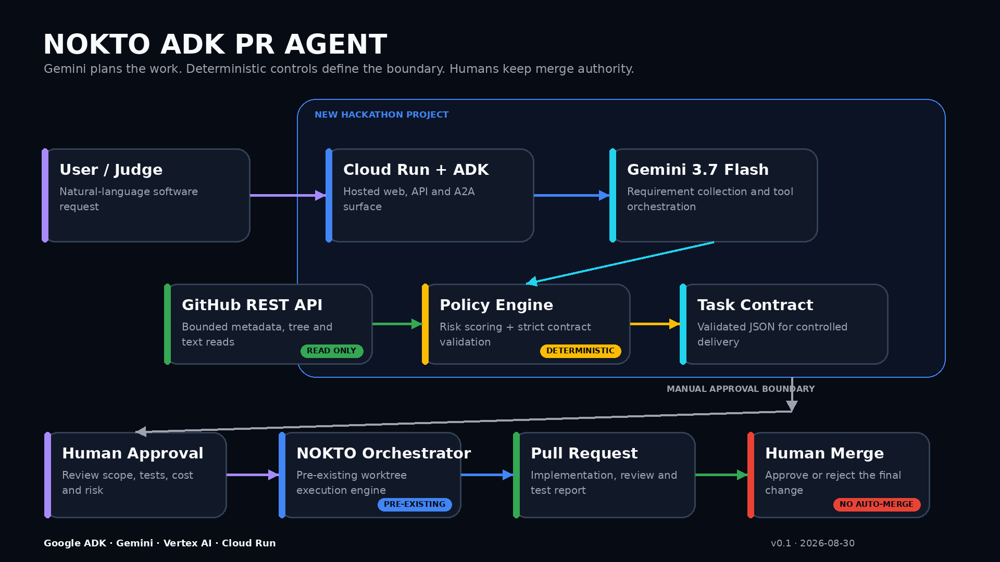

# NOKTO ADK PR Agent

Gemini turns software requests into validated, security-scoped task contracts for reviewable pull-request delivery.

Built with Google Agent Development Kit (ADK), Gemini 3.7 Flash, Vertex AI, and Cloud Run.

## What it does

1. Collects the repository, goal, scope, acceptance criteria, test commands, base branch, implementers, timeout, and retry limit.
2. Inspects GitHub repository metadata, tree structure, and selected non-sensitive text files through bounded read-only tools.
3. Calculates deterministic delivery risk and required controls.
4. Generates strict JSON accepted by the existing [`nokto-agent-orchestrator`](https://github.com/noktohq/nokto-agent-orchestrator) task contract.
5. Hands the validated contract to a human for deliberate execution in the orchestrator.

The Cloud Run agent does not modify repositories, execute code, dispatch the orchestrator, create pull requests, or merge changes. The downstream orchestrator performs those operations in an isolated worktree and always requires a human merge.

## Architecture



The editable system description and trust boundaries are documented in [docs/architecture.md](docs/architecture.md).

## Why this is agentic

Gemini manages the conversation, identifies missing task inputs, chooses the minimum repository context to inspect, calls deterministic tools, resolves validation failures, and produces the final handoff. Security-critical decisions stay in code rather than model judgment:

- Repository URLs are restricted to HTTPS on `github.com`.
- File reads block traversal, binary content, sensitive names, and files over 64 KiB.
- GitHub responses have timeouts and size limits.
- Authenticated GitHub access requires an explicit repository allowlist.
- Test commands use a binary allowlist and reject shell operators.
- Sensitive paths cannot enter the allowed scope.
- Risk controls always require independent review, secret scanning, and human merge approval.
- An ADK `before_tool_callback` blocks every tool outside the read-only allowlist.

## Project structure

```text
app/
├── agent.py          Gemini agent, instructions, and ADK tool wiring
├── github_tools.py   bounded read-only GitHub inspection
├── guardrails.py     ADK read-only tool allowlist
├── task_contract.py  deterministic risk and strict contract validation
└── fast_api_app.py   ADK/A2A server plus health endpoints
tests/
├── unit/             deterministic tests with no paid API calls
├── integration/      live Vertex AI and server tests
└── eval/             Gemini behavior evaluations
docs/
├── architecture.md
├── architecture.png
├── hackathon-submission.md
├── reproducible-testing.md
└── verification-status.md
```

## Requirements

- Python 3.11–3.13
- [`uv`](https://docs.astral.sh/uv/)
- [`agents-cli`](https://github.com/google/agents-cli) 1.4.2 or compatible
- Google Cloud project with billing and Vertex AI enabled
- Application Default Credentials for live Gemini tests

## Local setup

```bash
uvx google-agents-cli setup
agents-cli login -i
cp .env.example .env
```

Set your project in `.env`:

```dotenv
GOOGLE_GENAI_USE_VERTEXAI=true
GOOGLE_CLOUD_PROJECT=your-project-id
GOOGLE_CLOUD_LOCATION=global
```

Install dependencies:

```bash
agents-cli install
```

## Reproducible testing

The following sequence separates deterministic checks from paid/live Gemini calls.

### 1. Deterministic unit tests

```bash
uv run pytest tests/unit -q
```

Expected: all tests pass. These tests mock GitHub I/O and make no model calls.

### 2. Formatting, lint, spelling, and type checks

```bash
agents-cli lint
```

Expected: Ruff check and format, Codespell, and `ty` all pass.

### 3. Live Gemini smoke test

```bash
agents-cli run "Explain your role and whether you can directly change a repository."
```

Expected: the agent identifies itself as a read-only control plane and states that it cannot directly modify a repository or create/merge a pull request.

### 4. End-to-end contract test

```bash
agents-cli run "Inspect https://github.com/noktohq/nokto-agent-orchestrator and build a task contract. Title: Add reproducible test instructions. Goal: document the exact validation command. Allowed paths: README.md and docs/**. Disallowed paths: src/**. Acceptance criteria: README contains a reproducible testing section; no source files change. Test commands: pnpm run lint and pnpm run typecheck. Base branch: main. Implementers: codex and claude. Max retries: 1. Timeout: 15 minutes."
```

Expected:

- The agent uses GitHub read-only inspection.
- The response contains a risk result and complete JSON task contract.
- `testRequirements.mustPass` is `true`.
- `git.branchPrefix` is `agent/`.
- The response explicitly says no repository change or pull request occurred.

### 5. Full live integration suite

```bash
uv run pytest tests/integration -q
```

This suite starts the FastAPI/A2A server and calls Vertex AI. It requires working ADC and may incur Gemini usage charges.

More detail: [docs/reproducible-testing.md](docs/reproducible-testing.md).

Observed package-level checks and the remaining release gate are recorded in [docs/verification-status.md](docs/verification-status.md).

## Run the UI

```bash
agents-cli playground
```

Open `http://localhost:8080`, select the agent, and use the end-to-end prompt above.

Deterministic service checks:

```bash
curl http://localhost:8080/healthz
curl http://localhost:8080/api/v1/capabilities
```

## Deploy to Cloud Run

Deployment changes Google Cloud resources and should only run after explicit approval.

```bash
gcloud config set project your-project-id
agents-cli deploy
```

After deployment, verify `/healthz`, run the end-to-end prompt against the hosted ADK UI/API, inspect Cloud Logging, and retain the prior Cloud Run revision for rollback.

## Configuration

| Variable | Required | Purpose |
| --- | --- | --- |
| `GOOGLE_GENAI_USE_VERTEXAI` | Yes for Vertex AI | Selects Vertex AI authentication |
| `GOOGLE_CLOUD_PROJECT` | Yes for Vertex AI | Google Cloud project ID |
| `GOOGLE_CLOUD_LOCATION` | Yes for Vertex AI | Use `global` for the configured Gemini model |
| `GITHUB_TOKEN` | No | Raises GitHub API limits or allows explicitly scoped private reads |
| `GITHUB_ALLOWED_REPOSITORIES` | Required with `GITHUB_TOKEN` | Comma-separated exact repositories or `owner/*` patterns |
| `ALLOW_ORIGINS` | No | Comma-separated browser origins |

Never commit `.env` or tokens. Store production secrets in Google Secret Manager and grant the Cloud Run service account only the minimum required access.

## Honest boundary and project lineage

This submission project was created on 2026-08-30 with Google Agents CLI. It contains the new ADK/Gemini control plane, GitHub inspection tools, risk engine, contract validator, tests, Cloud Run configuration, and documentation.

`nokto-agent-orchestrator` is a separate, pre-existing component created on 2026-07-29. It contains the Claude Code/Codex worktree and pull-request execution pipeline. This repository does not present that earlier work as newly created hackathon code.

## License

[MIT](LICENSE) © 2026 Edin Nokto
