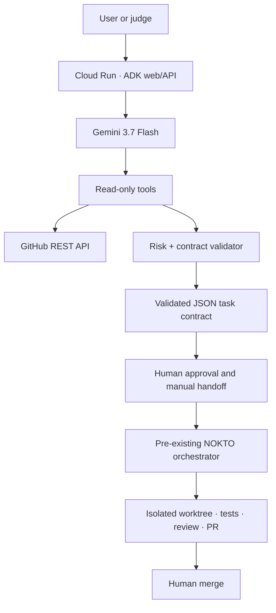

# Architecture

## System flow

## Components

| Component | Responsibility | Mutation level |
| --- | --- | --- |
| Cloud Run | Hosts ADK web/API and A2A routes | Session state only |
| Gemini 3.7 Flash | Collects requirements and orchestrates tools | None |
| GitHub tools | Reads metadata, tree entries, and bounded text files | Read-only |
| Risk engine | Scores declared scope and selects mandatory controls | None |
| Contract validator | Produces strict JSON for the existing Zod contract | None |
| Human handoff | Reviews scope and deliberately starts execution | Explicit action outside this app |
| NOKTO orchestrator | Plans, implements, reviews, tests, and opens a PR | Repository branch/PR only |
| Human reviewer | Reviews and merges or rejects the PR | Final approval |

## Trust boundaries

### Internet to Cloud Run

- User input is untrusted.
- ADK tool arguments are limited to 32 KiB.
- Every exposed tool is explicitly allowlisted.
- The cloud agent exposes no repository mutation tool.

### Cloud Run to GitHub

- Only `https://github.com/owner/repository` identifiers are accepted.
- API requests use the fixed `https://api.github.com` origin.
- Requests have a 10-second timeout and bounded response sizes.
- Text file reads are limited to 64 KiB.
- Traversal, binary files, credential files, and secret paths are blocked.
- If `GITHUB_TOKEN` is configured, `GITHUB_ALLOWED_REPOSITORIES` becomes mandatory.

### Model to deterministic policy

- The model cannot lower risk scores or required controls.
- Sensitive allowed paths and shell operators are rejected in code.
- Test commands must start with a binary supported by the existing orchestrator.
- Generated contracts are validated again before being returned.

### ADK agent to execution orchestrator

- The boundary is deliberately manual in this version.
- The ADK agent returns a contract but does not dispatch it.
- The orchestrator remains the execution authority and never auto-merges.

## Data handling

| Data | Storage | Retention |
| --- | --- | --- |
| ADK session messages | In-memory session service in this prototype | Lost on restart |
| GitHub repository context | Current model/tool invocation | Not persisted by custom code |
| Task contract | Returned to the user | User-controlled |
| Telemetry | Google Cloud telemetry configured by the scaffold | Controlled by project logging settings |
| Secrets | Environment/Secret Manager only | Never returned by tools |

Prompt and response content capture is disabled in the generated Terraform configuration.

## Failure behavior

- Invalid user input returns stable error codes.
- GitHub 404, access denial, rate limits, timeout, oversized responses, and invalid JSON fail closed.
- A failed tool call is reported; the agent is instructed never to invent repository data.
- Contract validation failure prevents handoff output.
- No failure path can create or merge a pull request because this service exposes no mutation capability.

## Rollback

The application is stateless beyond in-memory sessions. Rollback is performed by routing Cloud Run traffic to the previous known-good revision or redeploying the previous image. No database migration is required.

## Architecture asset manifest

| Asset | Purpose | Format | Dimensions | Color | Size |
| --- | --- | --- | --- | --- | --- |
| `docs/architecture.png` | Devpost architecture upload and README overview | PNG | 1920 × 1080 px | 8-bit RGB, sRGB | 103,294 bytes |

The diagram was created specifically for this project from the system architecture above. It contains no third-party photographs, logos, or externally licensed visual assets.

## Preflight status

- `CONFIRMED`: PNG signature, 1920 × 1080 pixel geometry, RGB/sRGB color, and non-interlaced encoding were inspected locally.
- `CONFIRMED`: File size is below Devpost's 35 MB upload limit.
- `CONFIRMED`: A full-resolution visual inspection found no clipping or overlapping labels.
- `DRAFT`: The diagram has not yet been uploaded to Devpost.
